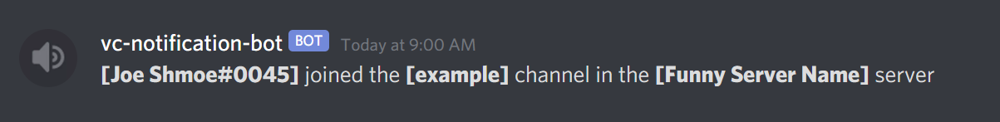

# vc-notification-bot
Also known as the FOMO Bot and the Stalking Bot, the vc-notification-bot is a dead simple tool to help you keep track of when people join voice channels in Discord built using the shiny new [Slash Commands API](https://discord.com/developers/docs/interactions/slash-commands). 

Simply use `/watch <channel>` to add a channel to your watchlist, and `/unwatch <channel>` to do the opposite. You can use `/watch <channel>` on as many voice channels as you like.

vc-notification-bot is built reactively using [Discord4J](https://github.com/Discord4J/Discord4J) and a [R2DBC](https://r2dbc.io/) managed PostgreSQL database backend.

# behavior
The bot will send you one message when someone first joins a voice channel that you are watching.

If multiple people join that voice channel, then the bot will edit its original message to show how many people joined.

The bot will continue to edit that same message everytime somebody joins until everyone has left the voice call. The bot will never notify you about people joining a call you are already in.

# releases
The notification/FOMO/stalking bot is released as both a compiled jar and a docker compose that builds from source. Should you want to use the jar, it requires being in the same directory as a `keys.txt` file that contains all the fields in the [example file](https://github.com/NathanNorth/vc-notification-bot/blob/master/docker-self-contained/keys.txt) (you'll need to specify credentials to your own PostgreSQL database in the keys).

A public discord bot anyone can use without self-hosting is also on the horizon.